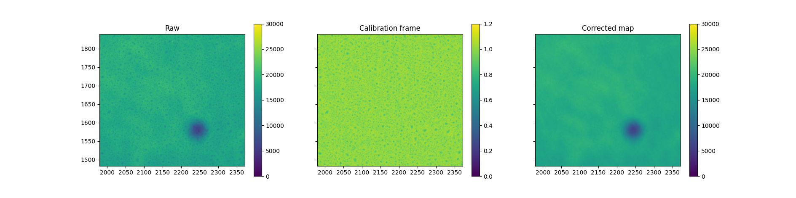

# SUIT Contamination Correction 🧹 ☀️ 🛰️ 

The SUIT instrument on Aditya-L1 maintains its image sensor at a very low temperature (-55 degC). This causes some volatiles to condense on the CCD surface. Traces of these contaminants are seen in the images recorded by SUIT.
This collection of modules is necessary to remove the contaminants from the SUIT images.

## Principle
The Aditya-L1 satellite has a jitter about its three axes. Jitter about the Pitch and Roll axes causes the image to shift randomly on the SUIT CCD. We exploit this as a dither by computing the exact shifts in the image, accurate to the pixel.

When the solar features are aligned, one particular contaminant pattern covers different regions of the Sun. This is exploited to generate a flat-field calibration file to remove the contaminants from each un aligned solar image.


## Modules 
The modules are designed to be user friendly- for implementation by the end user.

### `continuum_correction.py`: 
- Applies contaminant correction on full disk and RoI continuum images.
- **Requirements:** 2 days synoptic full-disk and required RoI images.

### `line_correction.py`:
- Uses north limb of the sun for co-alignment.
- Uses 2k NB03 images, upscales the flat fields and applies correction on RoI and fulldisk images.
- Useful for NB03 and NB04 channel images.
- **Requirements:** 2 days synoptic full-disk, or 10-20 2k full disk NB03 images, and required RoI images.

### `roi_line_correction.py`:
- Uses a user-defined template for alignment of RoI images.
- Suitable for target specific contamination correction.
- Suitable for RoI NB03, NB04 and NB08 images.
- **Requirements:** RoI images of a particular target.

### `scratch.py`
- Scratchpad for testing code sections.

## Screenshots




## Usage/Examples
SUIT image files are to be symlinked or placed at the specific folders based on the file type. Please ensure this folder structure is maintained before using the modules. The data files can be placed as symlinks in the specific folders.

Please ensure the following folder structure.
```
.
├── data
│   ├── external
│   ├── interim
│   ├── processed
│   └── raw
│       ├── full_disk 
│       └── roi 
├── products
│   ├── full_disk 
│   └── roi
├── README_files
├── README.md
├── reports
└── src
    ├── archive
    ├── continuum_correction.py
    ├── line_correction.py
    ├── roi_line_correction.py
    └── scratch.py
```

Note that the data should be placed as follows:
```
./data/raw/full_disk # Full disk images
./data/raw/roi # RoI images
```
The data will be saved as follows:
```
./products/full_disk # Full disk images
./products/roi # RoI images

```
## Authors

- [@janmejoysarkar](https://github.com/janmejoysarkar)

## Acknowledgements

 - [SUIT-POC, IUCAA](https://suit.iucaa.in)
 - [SUIT-team, MPS](https://mps.mpg.de)
 - [Aditya-L1, ISRO](https://www.isro.gov.in/Aditya_L1.html)
